<div align="center">

# ▲ Nifty Signals

**A self-hosted dashboard for Indian investors: stocks, mutual funds, gold and silver in one portfolio,<br>with BUY / HOLD / SELL signals from ten decision models, each with an honest track record.**


[Walkthrough](#-walkthrough) · [Quick start](#-quick-start) · [How the signals work](#-how-the-signals-work) · [Architecture](#-architecture) · [API](#-api-reference)

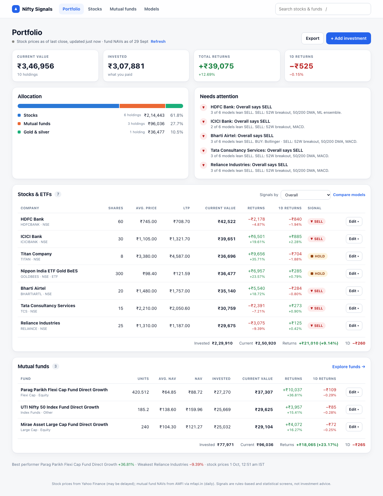

</div>

> [!WARNING]
> Nifty Signals is a research and tracking tool, **not investment advice**. Signals are rules-based and
> statistical screens. The best of them shift the odds by a few percentage points, and past results
> don't guarantee future ones.

---

## Contents

- [Why this exists](#-why-this-exists)
- [Walkthrough](#-walkthrough)
- [Quick start](#-quick-start)
- [How the signals work](#-how-the-signals-work)
- [Mutual funds](#-mutual-funds)
- [Architecture](#-architecture)
- [Project structure](#-project-structure)
- [API reference](#-api-reference)
- [ML pipeline](#-ml-pipeline)
- [Configuration and data](#-configuration-and-data)
- [Limitations](#-limitations)

---

## 💡 Why this exists

Broker apps show you *what you own*. They don't tell you what a consistent set of rules thinks of it, or
whether those rules have ever worked. Nifty Signals:

- **Puts everything in one place.** Stocks (NSE/BSE), ETFs, gold and silver, and mutual funds, valued live, with returns in broker terms.
- **Gives signals you can check.** Five classic technical rules, four machine-learning models and an overall vote. Every one is scored on the same out-of-sample test, so you can see which have actually worked.
- **Stays honest.** It shows t-statistics, not just hit rates, and it says plainly when a model is no better than a coin flip.
- **Keeps your data on your machine.** Holdings live in a local SQLite file. There's no account and no cloud.

---

## 🧭 Walkthrough

### 1. Portfolio: *"How am I doing?"*

Current value, invested amount, total and 1-day returns, allocation by asset class, and a **Needs attention**
list: holdings your chosen model says to SELL, positions above 25% of the portfolio, and IDCW fund plans whose
returns look worse than they are. Stocks and mutual funds each get their own table, with the columns
brokers use.

*(Screenshot at the top of this page.)*

### 2. Stocks: *"What's worth a look?"*

Index cards (Nifty 50, Nifty 200, Sensex, gold, silver, USD/INR) sit above sortable lists with 60-day sparklines. The
**Signals by** picker re-scores the whole list: columns, counts and sort order all follow the chosen model.

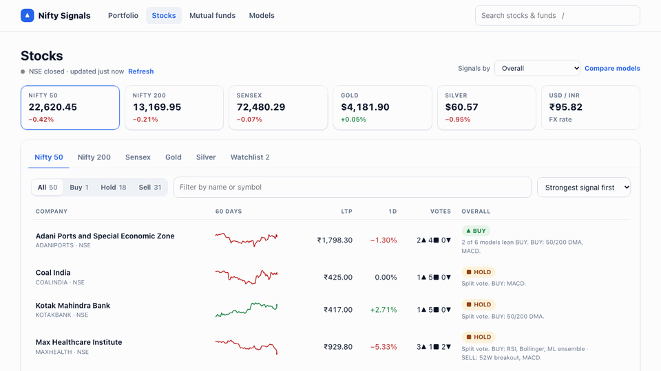

<details>
<summary>Stocks page</summary>
<br>
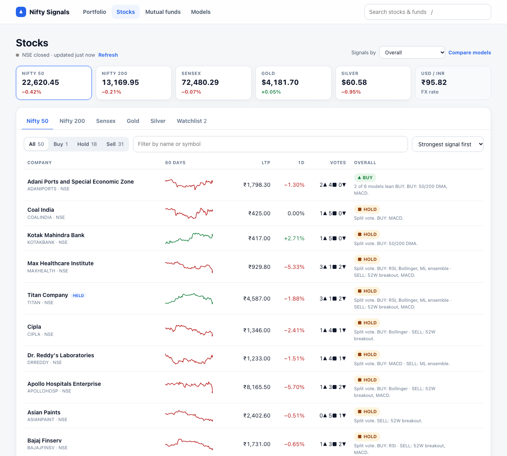
</details>

### 3. Stock page: *"Should I act on this one?"*

Your position, the overall verdict, a chart that draws **the selected model's own view** (moving averages,
Bollinger bands, or an RSI or MACD panel), every model's call with its reasoning, and the key numbers.


<details>
<summary>Full stock page</summary>
<br>
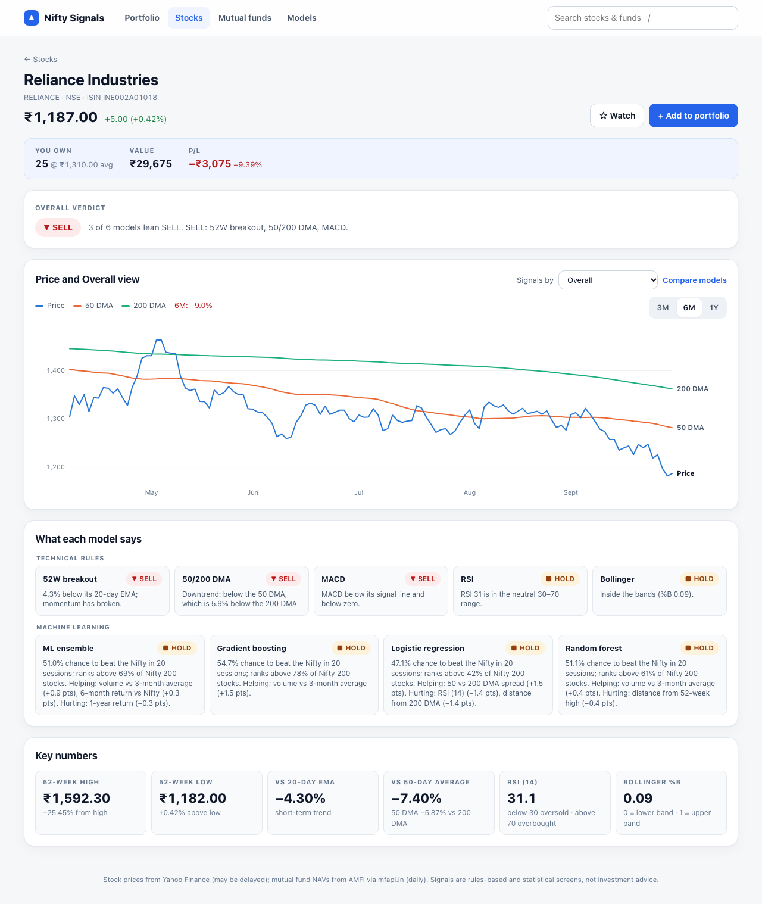
</details>

### 4. Mutual funds: *"How are my funds doing? Is this fund any good?"*

Every AMFI-registered scheme is searchable by name. Fund pages show **growth of ₹10,000 against the Nifty 50
(dividends reinvested)** on one shared axis, returns from 1 month to 5 years with the difference in points,
the worst fall, volatility, and how often 1-year periods ended in gain. Regular and IDCW plans carry clear warnings.

<table>
<tr>
<td width="50%">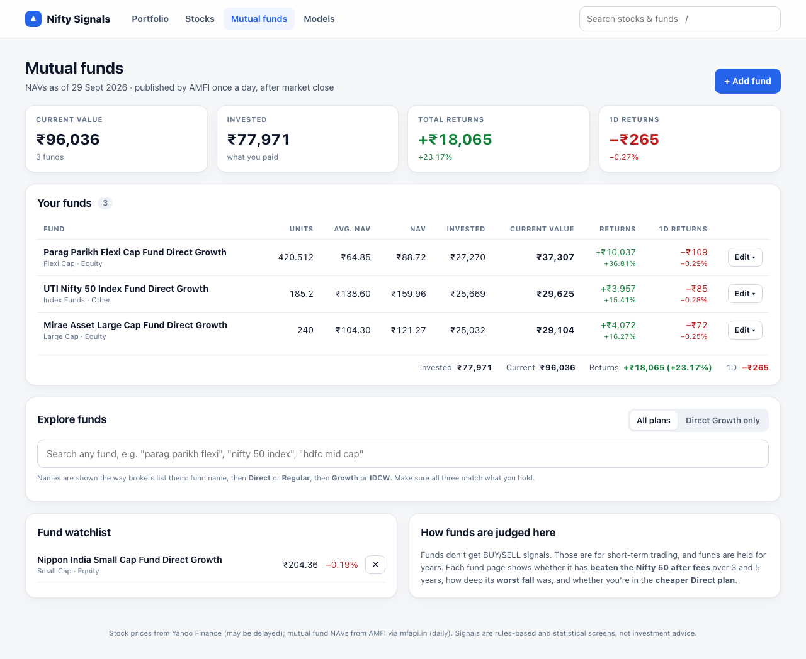</td>
<td width="50%">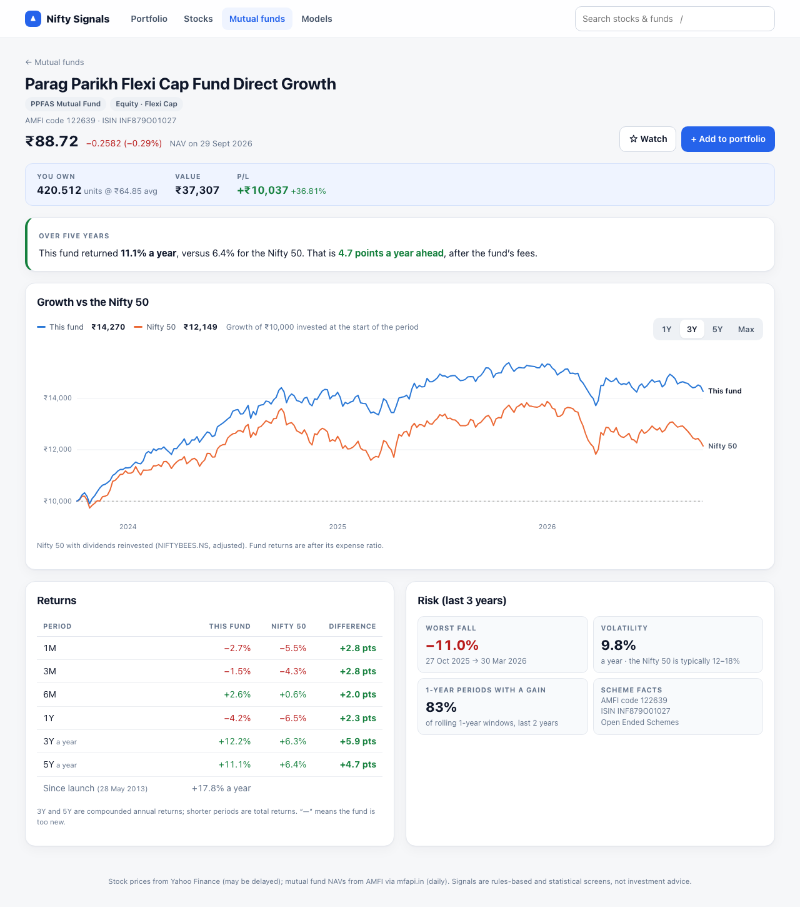</td>
</tr>
</table>

### 5. Models: *"Can I trust the signals?"*

Choose the model that drives signals across the app. The leaderboard compares all ten on the same test,
and each ML model has its own report: results by year, and which features it relies on.

<table>
<tr>
<td width="50%"></td>
<td width="50%">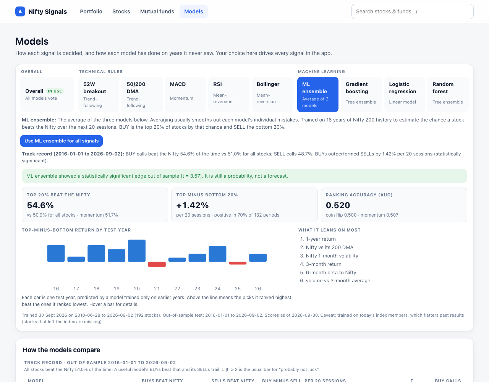</td>
</tr>
</table>

### 6. Search and add anything

One search box (press <kbd>/</kbd>) covers stocks and mutual funds. **+ Add investment** takes a stock, a fund (by name,
with the latest NAV filled in) or a CSV from your broker. Names match what brokers show: NSE's official company names,
and fund names with plan and option, e.g. *Parag Parikh Flexi Cap Fund Direct Growth*.

<table>
<tr>
<td width="50%">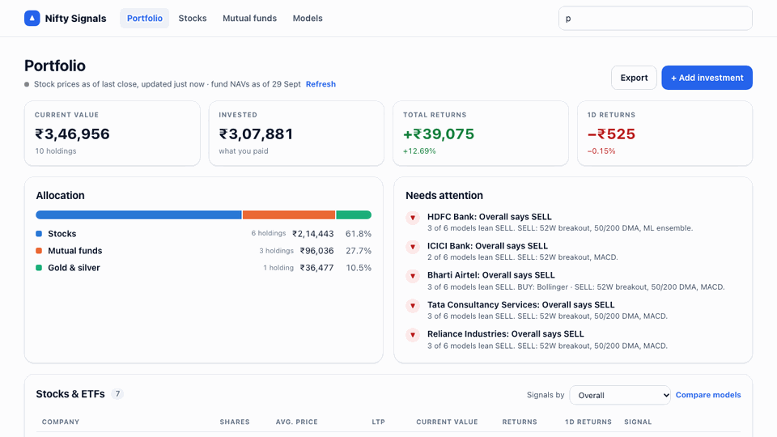</td>
<td width="50%">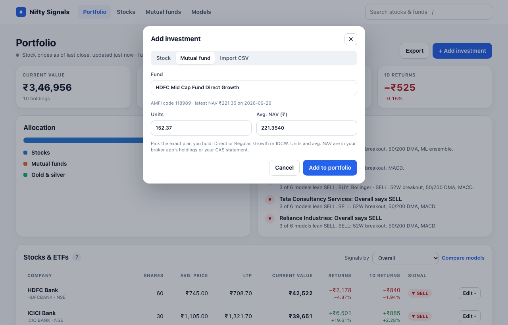</td>
</tr>
</table>

### 7. On your phone

Every page works at phone width. Wide tables scroll inside their cards, and the page itself never scrolls sideways.

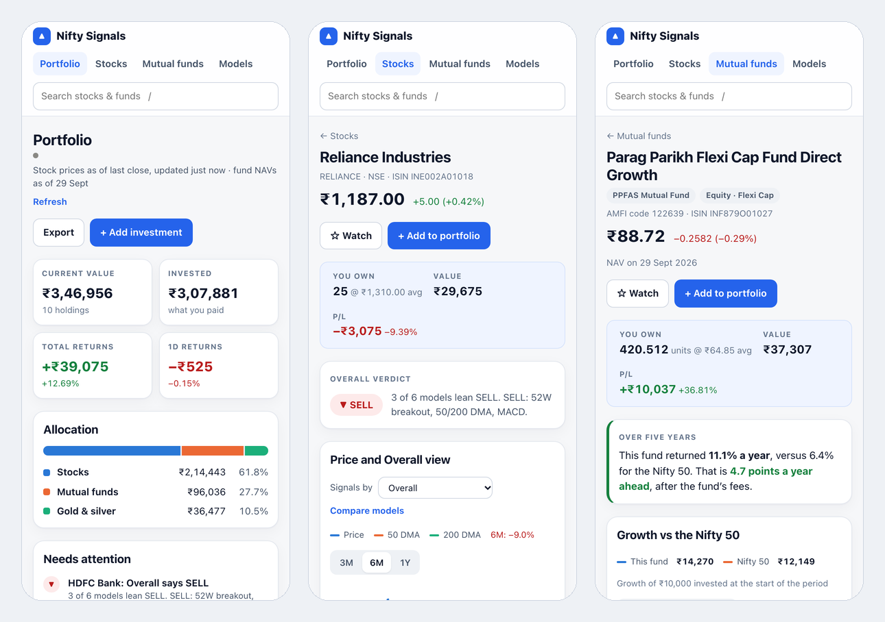

> Screenshots use a **sample portfolio**, not real holdings. Market data is from 30 Sep 2026.

---

## 🚀 Quick start

**Requirements:** Node.js 18+ and npm. Python 3.9+ is optional (for the ML models only).

```bash
git clone https://github.com/Pratyush1427/nifty-buy-sell.git
cd nifty-buy-sell
npm install
npm run dev                 # → http://localhost:3000
```

That's the whole app: portfolio, stocks, mutual funds and the five technical-rule models. To add the
**machine-learning models**:

```bash
python3 -m venv .venv
.venv/bin/pip install -r ml/requirements.txt
npm run ml                  # downloads 16 years of prices, evaluates, trains, scores (~6 min)
npm run ml:schedule         # optional (macOS): re-score every weekday at 18:30, retrain weekly
```

| Script | What it does |
|---|---|
| `npm run dev` | Start the app in development mode |
| `npm run build` / `npm start` | Production build and server |
| `npm run ml` | Full ML run: refresh index lists → download prices → walk-forward evaluation → train → score |
| `npm run ml:predict` | Re-score all stocks with the saved models (~10 s) |
| `npm run ml:schedule` / `ml:unschedule` | Install or remove the nightly job (macOS launchd) |

Everything you enter is stored in `data/portfolio.db` on your machine (git-ignored).

---

## 📈 How the signals work

Each stock is scored by **ten decision models**. Pick one on the Models page (or with any *Signals by*
picker); it drives every signal in the app.

| Model | Group | BUY when… | SELL when… |
|---|---|---|---|
| **Overall** *(default)* | Vote | BUY votes outnumber SELL votes by 2+ across the five rules and the ML ensemble | the reverse |
| **52W breakout** | Trend rule | within 2% of the 52-week closing high and above the 20-day EMA | below the 20-day EMA |
| **50/200 DMA** | Trend rule | price above the 50-day average, which is above the 200-day | price below the 50-day, which is below the 200-day |
| **MACD** (12, 26, 9) | Momentum rule | MACD above its signal line and above zero | below both |
| **RSI** (14) | Contrarian rule | RSI below 30 (oversold) | RSI above 70 (overbought) |
| **Bollinger** (20, 2σ) | Contrarian rule | close below the lower band | close above the upper band |
| **ML ensemble** | Machine learning | top 20% of the Nifty 200 by predicted chance of beating the Nifty over 20 sessions | bottom 20% |
| **Gradient boosting** | Machine learning | same, one model | same |
| **Logistic regression** | Machine learning | same, one model | same |
| **Random forest** | Machine learning | same, one model | same |

Anything else is **HOLD**. Indicators are computed from daily closes with today's live price folded in, and
they're checked against pandas (identical to 3 decimal places).

### Track record (out of sample, 2016 – 2026)

Every model was scored on the same test. Each year was predicted using only earlier data, outcomes were measured over
non-overlapping 20-session periods, and all stocks were compared with the Nifty 50. Across all stocks, **51.0%**
beat the Nifty in a given period.

| Model | BUY calls that beat the Nifty | SELL calls that beat the Nifty | BUY minus SELL, per 20 sessions | t-stat |
|---|---:|---:|---:|---:|
| ML ensemble | **54.6%** | 48.7% | **+1.42%** | **3.64** |
| Gradient boosting | 54.5% | 48.4% | +1.40% | 3.99 |
| Random forest | 53.5% | 47.7% | +1.36% | 3.77 |
| Logistic regression | 53.1% | 48.3% | +1.24% | 2.99 |
| Overall vote | 53.1% | 50.0% | +0.83% | 2.09 |
| RSI | 55.1% | 50.7% | +0.76% | 0.49 |
| 50/200 DMA | 52.1% | 51.7% | +0.64% | 1.48 |
| Bollinger | 52.5% | 49.1% | +0.62% | 0.79 |
| 52W breakout | 51.4% | 51.0% | +0.03% | 0.07 |
| MACD | 51.1% | 50.3% | −0.04% | −0.12 |

**How to read this:** a t-stat of about 2 or more is the usual bar for "probably not luck". All four ML models clear it.
None of the classic rules do, and the 52W breakout and MACD rules are indistinguishable from chance.
These figures are before trading costs, and they're flattered by training on today's index members (see [Limitations](#-limitations)).

---

## 🏦 Mutual funds

- **Data:** AMFI's daily NAVs via [mfapi.in](https://www.mfapi.in), with full history from launch. Cached for 6 hours.
- **No BUY/SELL signals, by design.** Trading signals target short-term swings; funds are held for years. Instead,
  each fund page answers: has it **beaten the Nifty 50 after fees** over 3 and 5 years, how deep was its **worst fall**,
  and are you in the **cheaper Direct plan**?
- **Fair benchmark:** equity funds are compared with `NIFTYBEES` with dividends reinvested, which stands in for the Nifty 50 Total Return Index.
  As a check, the UTI Nifty 50 Index Fund trails it by only about its own fees.
- **Naming:** funds are shown the way brokers list them (fund name, then Direct or Regular, then Growth or IDCW), with the AMFI code and ISIN for exact matching.
- Stored as holdings with symbol `MF:<AMFI scheme code>`, so CSV import works for funds too.

---

## 🧱 Architecture

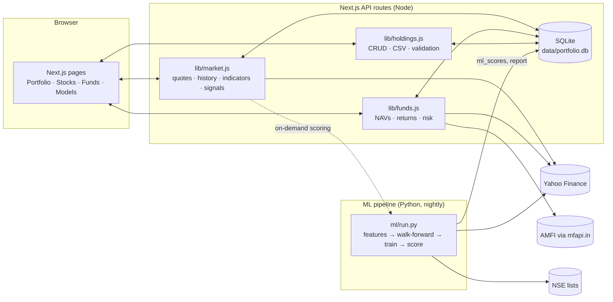

**Resilience:**
- **Batched, cached requests:** all quotes arrive in one Yahoo request (cached 60 s), and price history is cached for 30 minutes.
- **Survives outages:** the last good data is saved in SQLite, so an outage or restart shows real prices marked *stale* rather than invented numbers.
- **Backs off after failures:** it pauses for 15 s, doubling up to 5 min, instead of retrying Yahoo constantly.
- **Checks what you enter:** symbols are validated before saving, and CSV imports are all-or-nothing.

---

## 📁 Project structure

```
├── pages/                  Next.js pages and API routes
│   ├── index.js            Portfolio
│   ├── stocks/             Stock lists and stock detail
│   ├── funds/              Mutual funds and fund detail
│   ├── models.js           Model picker, leaderboard, ML reports
│   └── api/                market · chart · instrument · search · portfolio · watchlist · funds/* · models · ml-score
├── components/             AppShell, GlobalSearch, AddInvestment, HoldingsTable, PriceChart, FundChart, Leaderboard, …
├── lib/
│   ├── market.js           Yahoo quotes/history, caching, circuit breaker
│   ├── indicators.js       SMA, EMA, RSI, MACD, Bollinger
│   ├── strategies.js       The ten decision models (shared by server and browser)
│   ├── funds.js            Mutual fund data, returns, risk
│   ├── names.js            Broker-style names and ISINs from NSE's official list
│   ├── holdings.js         Portfolio storage, CSV parsing
│   └── universes.js        Stock list tabs (add a tab here)
├── ml/                     Python: features, models, walk-forward evaluation, scoring
├── backtest/               Standalone backtest of the 52W breakout rule
├── scripts/schedule-ml.sh  Nightly job installer (macOS launchd)
├── data/                   Index constituent CSVs (tracked); your database and caches (ignored)
└── docs/images/            Screenshots and GIFs for this README
```

---

## 🔌 API reference

| Route | Purpose |
|---|---|
| `GET /api/market?universe=nifty50&symbols=A.NS,B.NS` | Benchmarks, FX, and every model's signals for a list plus extra symbols |
| `GET /api/instrument?symbol=RELIANCE` | Price and all ten verdicts for any one stock |
| `GET /api/chart?symbol=RELIANCE` | Daily closes with EMA/SMA, Bollinger, RSI and MACD series |
| `GET /api/search?q=tata` | Stock search (NSE first) |
| `GET /api/funds/search?q=parag` | Mutual fund search (best match, then Direct Growth first) |
| `GET /api/funds/:code` | Fund detail: NAV history, returns vs benchmark, risk |
| `GET /api/funds/quotes?symbols=MF:122639` | Latest NAVs |
| `GET` · `POST` · `PUT` · `DELETE /api/portfolio` | Holdings: list (`?format=csv` to export), add or import, edit, remove |
| `GET` · `POST` · `DELETE /api/watchlist` | Watchlist (stocks and funds) |
| `GET /api/models` | ML evaluation report and leaderboard |
| `POST /api/ml-score` | Score a stock outside the Nifty 200 with the ML models (~3 s) |

Symbols are normalised: `infy` → `INFY.NS`. Use `.BO` for BSE-only listings and `MF:<code>` for funds.
CSV import accepts `symbol`, `shares`/`qty`/`units` and `avg_price`/`average price` columns in any order.

---

## 🤖 ML pipeline

- **Target:** will a stock beat the Nifty 50 over the next 20 sessions? Predicting *relative* return removes market-wide moves, which no stock-level feature can forecast.
- **Features (30):** returns over 1 week to 1 year, volatility, RSI, MACD, distance from the 20/50/200-day averages, distance from the 52-week high and low, Bollinger %B and width, volume trend, strength relative to the Nifty, beta, market conditions, and rankings within the universe.
- **Universe:** the Nifty 200, with lists refreshed from NSE on each full run. About 650,000 stock-days since 2010.
- **Models:** scikit-learn `HistGradientBoostingClassifier`, `LogisticRegression` and `RandomForestClassifier`, plus their average (the ensemble).
- **Evaluation:** walk-forward by year from 2016. Each year is predicted by models trained only on data ending 40 days before it starts.
- **Explanations:** each score lists the features pushing it up or down, found by resetting each feature to that day's median across the universe.
- **Beyond the Nifty 200:** stocks you hold or watch are scored nightly, and any stock can be scored on demand. These scores are flagged as less reliable.

---

## 🔧 Configuration and data

| Setting | Purpose |
|---|---|
| `lib/universes.js` | Stock list tabs. Add Bank Nifty, crude, etc. as a new entry (benchmark plus a CSV or symbol list) |
| `PORTFOLIO_DB=/path/to.db` | Use a different database, e.g. a demo or test copy |
| `NEXT_DIST_DIR=.next-test` | Build into another folder without disturbing a running dev server |
| `data/nifty50.csv`, `nifty200.csv` | Refreshed from NSE by `npm run ml`. `sensex.csv` is maintained by hand. |

**Data sources:** [Yahoo Finance](https://finance.yahoo.com) for stock prices (may be delayed),
[mfapi.in](https://www.mfapi.in) / AMFI for fund NAVs, and [NSE](https://www.nseindia.com) for index constituents and official company names.

---

## 🚧 Limitations

- **Survivorship bias:** the ML models train on *today's* index members, so stocks that fell out of the index are missing. Historical results are flattered.
- **No trading costs:** returns in the track record are before brokerage, taxes and slippage.
- **Delayed and unofficial data:** Yahoo quotes may lag, and the free sources can change or rate-limit without notice.
- **Small edges:** the best models improve the chance of beating the Nifty from about 51% to 55%. That's a statistical tilt, not a forecast.
- **Only one rule is backtested with trades:** `backtest/` simulates the 52W breakout rule with stops. The other rules are scored only in the ML pipeline's evaluation.

---

<div align="center">
<sub>Not investment advice. Built for learning and personal tracking.</sub>
</div>
