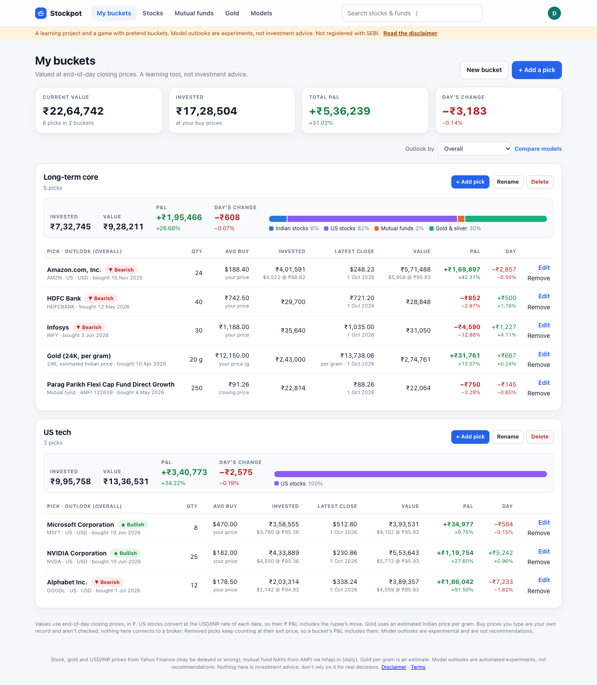
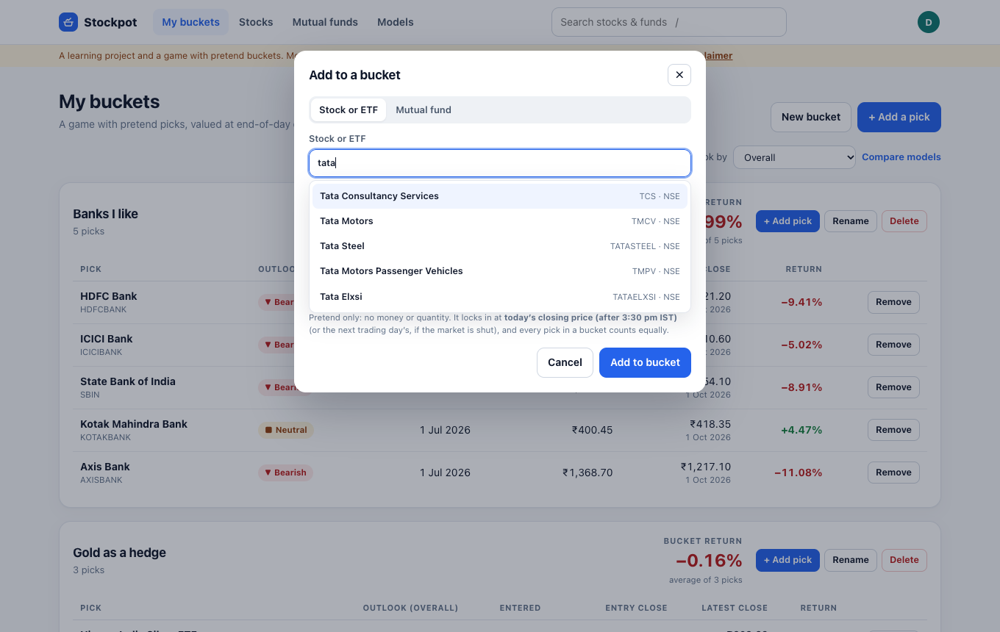
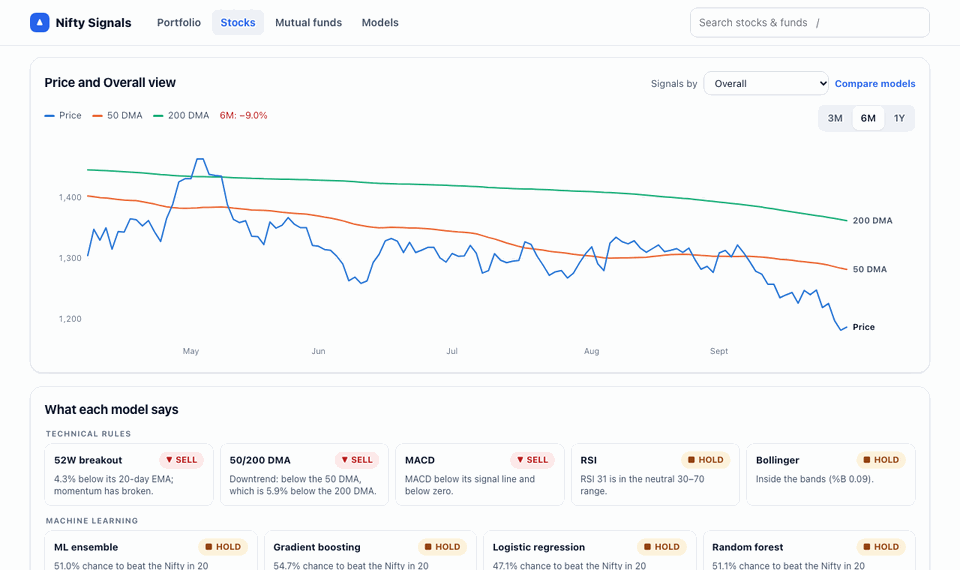
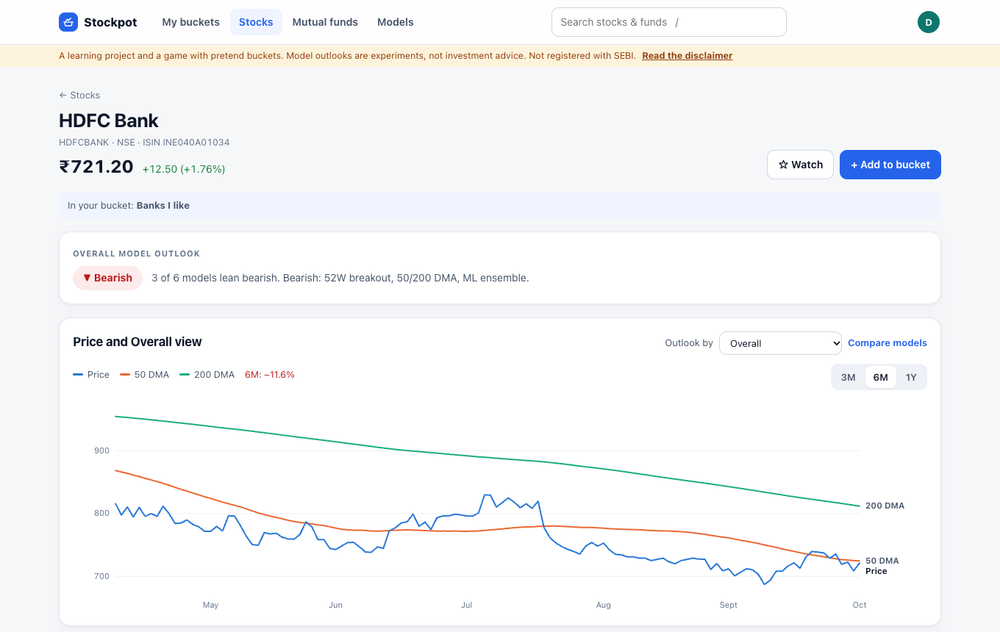
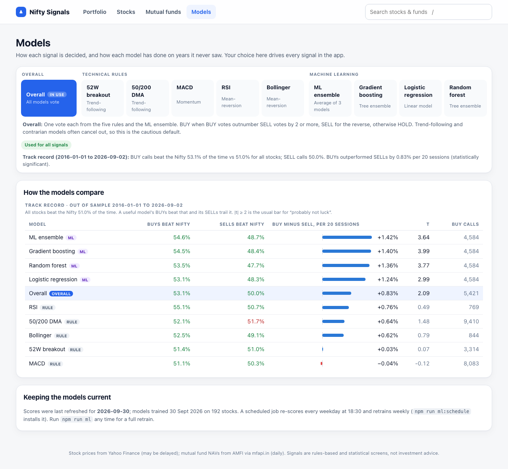
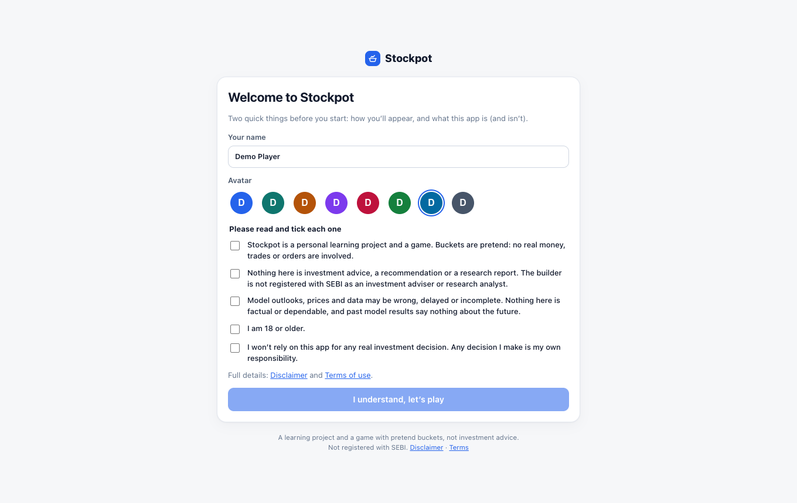
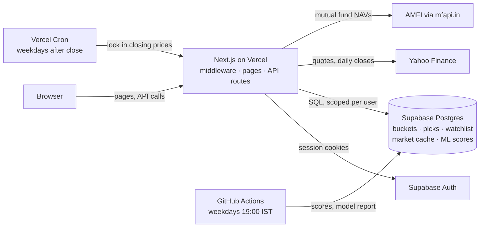

<div align="center">

# Stockpot

**A learning game for Indian markets: build pretend buckets of stocks, mutual funds, gold and silver,
and see how your ideas would have done at real closing prices.**


</div>

> [!IMPORTANT]
> Stockpot is a **personal learning project and a game**. Buckets are pretend: no real money, orders or holdings.
> Nothing here is investment advice, a recommendation or a research report, and the builder is **not registered
> with SEBI**. Model outlooks are automated experiments; prices can be wrong or late. Don’t use it for real decisions.



## Contents

- [How the game works](#how-the-game-works)
- [Model outlooks](#model-outlooks)
- [Accounts and privacy](#accounts-and-privacy)
- [Architecture](#architecture)
- [Run it locally](#run-it-locally)
- [Deploy](#deploy)
- [Project structure](#project-structure)

## How the game works

1. **Make a bucket for an idea.** “Banks I like”, “Gold as a hedge”, “IT turnaround”. Up to 5 buckets.
2. **Add picks.** Any NSE/BSE stock or ETF (one-tap gold and silver), or any mutual fund by name. Up to 25 per bucket.
3. **Each pick locks in at a closing price.** Added before 3:30 pm IST on a trading day: that day’s close.
   Later, or on a weekend or holiday: the next trading day’s close. There are no live prices in the game.
4. **Track it.** Each pick shows its return from entry close to the latest close. A bucket’s return is the plain
   average of its picks: no quantities or money, so every pick counts equally.
5. **Removing a pick** exits it at the next close, and its result **stays in the bucket’s record**, so losing picks
   can’t be quietly hidden.

Everything is end-of-day on purpose: SEBI and the exchanges have warned against virtual-trading games built on
real-time prices. There is no leaderboard and nothing to win; buckets are private.



## Model outlooks

Every stock gets a **Bullish / Neutral / Bearish outlook** from ten models built while learning: five classic
technical rules (52-week breakout, 50/200-day averages, MACD, RSI, Bollinger bands), three machine-learning models
(gradient boosting, logistic regression, random forest) and their ensemble, plus an overall vote.



- The ML models estimate the chance a stock beats the Nifty over the next 20 sessions, trained on Nifty 200 history
  from 2010. Outlooks are percentile bands of that estimate, not price targets.
- The **Models** page shows how each model behaved in a **walk-forward historical test** on years it never saw,
  with t-statistics. Most results are within what chance would explain. Past tests say nothing about the future.
- A nightly job on GitHub Actions re-scores every stock in the Nifty 200 or anyone’s bucket or watchlist, and
  retrains weekly.

| Stock page | Models page |
|---|---|
|  |  |

## Accounts and privacy

- **Sign in** with email and password (confirmed by email), an email magic link, or Google, via Supabase Auth.
- **Onboarding consent:** before using the app, every user picks a name and avatar and ticks five acknowledgements
  (a learning game, not advice and not SEBI-registered, unreliable data, 18+, own responsibility). Consent is stored
  with a timestamp and checked server-side on every request; users can’t grant it to themselves.
- **Private by design:** every query is scoped to the signed-in user; row level security is on for every table so
  Supabase’s public API can’t read anything. Users can delete their account and all its data from the Account page.



## Architecture



- **Web app:** Next.js 14 (Pages Router). Middleware refreshes the Supabase session and gates pages; API routes
  check the user and consent themselves.
- **Database:** Postgres with the schema in [`supabase/migrations`](supabase/migrations). Market data and ML
  scores are shared; buckets, picks and watchlists belong to a user.
- **Prices:** fetched on demand and cached in memory and in Postgres. Picks are filled from final daily closes
  when buckets are read, and by an evening cron for users who don’t visit.
- **ML pipeline:** Python and scikit-learn in [`ml/`](ml), run by
  [`.github/workflows/nightly-ml.yml`](.github/workflows/nightly-ml.yml). Trained models persist in the
  Actions cache; a cache miss simply retrains (about 6 minutes).

## Run it locally

You need Node 20+, Docker Desktop and Python 3.9+.

```bash
npm install
npm run db:start               # local Supabase (Postgres + Auth + test inbox) in Docker
npm run env:local              # writes .env.local with the local connection details

python3 -m venv .venv && .venv/bin/pip install -r ml/requirements.in
npm run ml                     # first run trains the models and writes scores (~6 minutes)

npm run dev                    # http://localhost:3100
```

Sign-up emails land in the local test inbox at http://127.0.0.1:54324. `npm run ml:predict` re-scores with the
saved models; `npm run db:reset` wipes the local database.

## Deploy

Vercel (web app and evening cron) + Supabase (database and auth) + GitHub Actions (nightly ML), all on free
tiers. Step-by-step: [docs/DEPLOY.md](docs/DEPLOY.md).

## Project structure

```
pages/            UI pages and API routes (pages/api)
  api/buckets.js, api/picks.js    the game
  api/cron/fill-picks.js          evening closing-price fill
  login, signup, welcome, account, terms, disclaimer
components/       UI components (buckets dialog, charts, layout)
lib/
  buckets.js      game rules: closing-day pricing, returns, limits
  closingDay.js   which session's close prices an action
  market.js       quotes, histories, outlooks; cached in Postgres
  strategies.js   the ten models' rules and wording
  supabase/       auth clients (server, browser, admin)
middleware.js     session refresh, sign-in and consent gates
ml/               Python pipeline: features, walk-forward training, scoring
supabase/         local config, migrations, email templates
backtest/         standalone backtest of the breakout rule
```
